# Azure AI-900 Exam Notes / Preparation Repository

## Purpose

This repository is designed to assist you in preparing for the AI-900 exam. Unlike other exams, this one is relatively straightforward if you thoroughly understand the content covered in the official [learning paths](https://docs.microsoft.com/en-us/learn/certifications/exams/ai-900). Utilizing practice questions helped me pass the exam on my first attempt. [Verify my certification](https://learn.microsoft.com/en-us/users/anxkhn/credentials/60e4a16a343378da).

**Official Website:** [Microsoft Azure AI Fundamentals](https://learn.microsoft.com/en-us/credentials/certifications/azure-ai-fundamentals)

**Official Study Material:** [Microsoft Certified: Azure AI Fundamentals](https://learn.microsoft.com/en-us/credentials/certifications/azure-ai-fundamentals)

**Practice Tests:** [Official, Free, Recommended](https://learn.microsoft.com/en-us/credentials/certifications/azure-ai-fundamentals/?practice-assessment-type=certification#certification-practice-for-the-exam)

I have been exploring a lot of resources for the AI-900 exam, especially to cram for it, and I have compiled a list of resources that I found helpful. I found banks of questions which were behind a paywall ranging from $5 to $75. I don't think it's needed. I compiled a list of questions from the web and the official practice tests myself, and I am providing it to you for free. Don't pay for any services online. You can pass this exam with the resources I have provided.

## Skills Measured

- Describe Artificial Intelligence workloads and considerations
- Describe fundamental principles of machine learning on Azure
- Describe features of computer vision workloads on Azure
- Describe features of Natural Language Processing (NLP) workloads on Azure
- Describe features of generative AI workloads on Azure

## Preparation Strategy 2024

**Preparation time:** 1-2 weeks, depending on your current knowledge of AI and Azure.

The Azure AI-900 exam has evolved over the years, with recent additions such as Generative AI, making it essential to prepare accordingly.

### Recommended Strategy

1. **Official Learning Path:** Begin with the [official learning path](https://docs.microsoft.com/en-us/learn/certifications/exams/ai-900) from Microsoft for a comprehensive overview of the exam topics.
2. **YouTube Videos:** Watch the latest videos on YouTube. This video from FCC covers almost everything you need. Take notes or screenshots.
   [YouTube Video](https://www.youtube.com/watch?v=hHjmr_YOqnU)

3. **Practice Previous Exam Questions:** These resources will provide a good understanding of the exam questions, which are not limited to multiple-choice questions. I highly recommend reviewing these:

   - [YouTube Video 1](https://www.youtube.com/watch?v=edEfRpQSjXs)
   - [YouTube Video 2](https://www.youtube.com/watch?v=7j1C41LbNYk)

4. **Official Practice Tests:** Microsoft offers free practice tests for the AI-900 exam. These are an excellent way to test your knowledge and get familiar with the question format.
   [Official Practice Tests](https://learn.microsoft.com/en-us/credentials/certifications/azure-ai-fundamentals/?practice-assessment-type=certification#certification-practice-for-the-exam)

5. **Review Repository Questions:** This repository contains questions I prepared, providing a realistic understanding of exam questions.

   [Notes](notes.md) |
   [Questions](questions.md)

## Cram Strategy 2024

We all know that engineering undergrads do things last minute, worry not. I have a cram strategy for you which worked for me and my friend, since this was a fairly easy exam you should be able to pass it with this strategy:

**Preparation time:** 1-2 days, 4-8 hours total.

### Recommended Cram Strategy

1. **YouTube Video:** Watch the FCC video, taking notes or screenshots.
   [YouTube Video](https://www.youtube.com/watch?v=hHjmr_YOqnU)

2. **Limited Learning Path:** Focus on Responsible AI, Generative AI, and machine learning (clustering, regression, and classification).
   [Official Learning Path](https://docs.microsoft.com/en-us/learn/certifications/exams/ai-900)

3. **Review Repository Questions:** This repository contains questions I prepared, providing a realistic understanding of exam questions.
   [Notes](notes.md) |
   [Questions](questions.md)

## Notes

## Questions

#### **QUESTION: 1**

A company employs a team of customer service agents to provide telephone and email support to customers.

The company develops a webchat bot to provide automated answers to common customer queries.  
Which business benefit should the company expect as a result of creating the webchat bot solution?

1.  increased sales
2.  a reduced workload for the customer service agents
3.  improved product reliability

**Answer(s):** B

#### **QUESTION: 2**

For a machine learning progress, how should you split data for training and evaluation?

1.  Use features for training and labels for evaluation.
2.  Randomly split the data into rows for training and rows for evaluation.
3.  Use labels for training and features for evaluation.
4.  Randomly split the data into columns for training and columns for evaluation.

**Answer(s):** B

##### **Explanation:**

The Split Data module is particularly useful when you need to separate data into training and testing sets. Use the Split Rows option if you want to divide the data into two parts. You can specify the percentage of data to put in each split, but by default, the data is divided 50-50. You can also randomize the selection of rows in each group, and use stratified sampling.

##### **Reference:**

https://docs.microsoft.com/en-us/azure/machine-learning/studio-module-reference/split-data

#### **QUESTION: 3**

HOTSPOT (Drag and Drop is not supported)  
You are developing a model to predict events by using classification.  
You have a confusion matrix for the model scored on test data as shown in the following exhibit.  

Use the drop-down menus to select the answer choice that completes each statement based on the information presented in the graphic.  
Note: Each correct selection is worth one point.  
Hot Area:

**Answer(s):** A

##### **Explanation:**

Box 1: 11

TP = True Positive.  
The class labels in the training set can take on only two possible values, which we usually refer to as positive or negative. The positive and negative instances that a classifier predicts correctly are called true positives (TP) and true negatives (TN), respectively. Similarly, the incorrectly classified instances are called false positives (FP) and false negatives (FN).

Box 2: 1,033  
FN = False Negative

##### **Reference:**

https://docs.microsoft.com/en-us/azure/machine-learning/studio/evaluate-model-performance

#### **QUESTION: 4**

You build a machine learning model by using the automated machine learning user interface (UI).  
You need to ensure that the model meets the Microsoft transparency principle for responsible AI.  
What should you do?

1.  Set Validation type to Auto.
2.  Enable Explain best model.
3.  Set Primary metric to accuracy.
4.  Set Max concurrent iterations to 0.

**Answer(s):** B

##### **Explanation:**

Model Explain Ability.  
Most businesses run on trust and being able to open the ML ג€black boxג€ helps build transparency and trust. In heavily regulated industries like healthcare and banking, it is critical to comply with regulations and best practices. One key aspect of this is understanding the relationship between input variables (features) and model output. Knowing both the magnitude and direction of the impact each feature (feature importance) has on the predicted value helps better understand and explain the model. With model explain ability, we enable you to understand feature importance as part of automated ML runs.

##### **Reference:**

https://azure.microsoft.com/en-us/blog/new-automated-machine-learning-capabilities-in-azure-machine-learning-service/

#### **QUESTION: 5**

HOTSPOT (Drag and Drop is not supported)  
For each of the following statements, select Yes if the statement is true. Otherwise, select No.  
Note: Each correct selection is worth one point.  
Hot Area:

**Answer(s):** A

##### **Explanation:**

Anomaly detection encompasses many important tasks in machine learning:  
Identifying transactions that are potentially fraudulent.  
Learning patterns that indicate that a network intrusion has occurred.  
Finding abnormal clusters of patients.  
Checking values entered into a system.

##### **Reference:**

https://docs.microsoft.com/en-us/azure/machine-learning/studio-module-reference/anomaly-detection

#### **QUESTION: 6**

HOTSPOT (Drag and Drop is not supported)  
To complete the sentence, select the appropriate option in the answer area.  
Hot Area:

**Answer(s):** A

##### **Explanation:**

Reliability and safety:  
AI systems need to be reliable and safe in order to be trusted. It is important for a system to perform as it was originally designed and for it to respond safely to new situations. Its inherent resilience should resist intended or unintended manipulation. Rigorous testing and validation should be established for operating conditions to ensure that the system responds safely to edge cases, and A/B testing and champion/challenger methods should be integrated into the evaluation process.  
An AI system's performance can degrade over time, so a robust monitoring and model tracking process needs to be established to reactively and proactively measure the model's performance and retrain it, as necessary, to modernize it.

##### **Reference:**

https://docs.microsoft.com/en-us/azure/cloud-adoption-framework/innovate/best-practices/trusted-ai

#### **QUESTION: 7**

DRAG DROP (Drag and Drop is not supported)  
Match the types of AI workloads to the appropriate scenarios.  
To answer, drag the appropriate workload type from the column on the left to its scenario on the right. Each workload type may be used once, more than once, or not at all.  
Note: Each correct selection is worth one point.  
Select and Place:

**Answer(s):** A

##### **Explanation:**

Box 3: Natural language processing  
Natural language processing (NLP) is used for tasks such as sentiment analysis, topic detection, language detection, key phrase extraction, and document categorization.

##### **Reference:**

https://docs.microsoft.com/en-us/azure/architecture/data-guide/technology-choices/natural-language-processing

#### **QUESTION: 8**

You are designing an AI system that empowers everyone, including people who have hearing, visual, and other impairments.  
This is an example of which Microsoft guiding principle for responsible AI?

1.  fairness
2.  inclusiveness
3.  reliability and safety
4.  accountability

**Answer(s):** B

##### **Explanation:**

Inclusiveness: At Microsoft, we firmly believe everyone should benefit from intelligent technology, meaning it must incorporate and address a broad range of human needs and experiences. For the 1 billion people with disabilities around the world, AI technologies can be a game-changer.

##### **Reference:**

https://docs.microsoft.com/en-us/learn/modules/responsible-ai-principles/4-guiding-principles

#### **QUESTION: 9**

DRAG DROP (Drag and Drop is not supported)  
Match the Microsoft guiding principles for responsible AI to the appropriate descriptions.  
To answer, drag the appropriate principle from the column on the left to its description on the right. Each principle may be used once, more than once, or not at all.  
Note: Each correct selection is worth one point.  
Select and Place:

**Answer(s):** A

##### **Explanation:**

Box 1: Reliability and safety  
To build trust, it's critical that AI systems operate reliably, safely, and consistently under normal circumstances and in unexpected conditions. These systems should be able to operate as they were originally designed, respond safely to unanticipated conditions, and resist harmful manipulation.

Box 2: Accountability  
The people who design and deploy AI systems must be accountable for how their systems operate. Organizations should draw upon industry standards to develop accountability norms. These norms can ensure that AI systems are not the final authority on any decision that impacts people's lives and that humans maintain meaningful control over otherwise highly autonomous AI systems.

Box 3: Privacy and security  
As AI becomes more prevalent, protecting privacy and securing important personal and business information is becoming more critical and complex. With AI, privacy and data security issues require especially close attention because access to data is essential for AI systems to make accurate and informed predictions and decisions about people. AI systems must comply with privacy laws that require transparency about the collection, use, and storage of data and mandate that consumers have appropriate controls to choose how their data is used

##### **Reference:**

https://docs.microsoft.com/en-us/learn/modules/responsible-ai-principles/4-guiding-principles

#### **QUESTION: 10**

HOTSPOT (Drag and Drop is not supported)  
To complete the sentence, select the appropriate option in the answer area.  
Hot Area:

**Answer(s):** A

##### **Explanation:**

Reliability and safety: To build trust, it's critical that AI systems operate reliably, safely, and consistently under normal circumstances and in unexpected conditions.  
These systems should be able to operate as they were originally designed, respond safely to unanticipated conditions, and resist harmful manipulation.

##### **Reference:**

https://docs.microsoft.com/en-us/learn/modules/responsible-ai-principles/4-guiding-principles

#### **QUESTION: 11**

You are building an AI system.  
Which task should you include to ensure that the service meets the Microsoft transparency principle for responsible AI?

1.  Ensure that all visuals have an associated text that can be read by a screen reader.
2.  Enable autoscaling to ensure that a service scales based on demand.
3.  Provide documentation to help developers debug code.
4.  Ensure that a training dataset is representative of the population.

**Answer(s):** C

##### **Reference:**

https://docs.microsoft.com/en-us/learn/modules/responsible-ai-principles/4-guiding-principles

#### **QUESTION: 12**

DRAG DROP (Drag and Drop is not supported)  
Match the types of AI workloads to the appropriate scenarios.  
To answer, drag the appropriate workload type from the column on the left to its scenario on the right. Each workload type may be used once, more than once, or not at all.  
Note: Each correct selection is worth one point.  
Select and Place:

**Answer(s):** A

##### **Explanation:**

##### **Reference:**

https://docs.microsoft.com/en-us/learn/paths/get-started-with-artificial-intelligence-on-azure/

#### **QUESTION: 13**

Your company is exploring the use of voice recognition technologies in its smart home devices. The company wants to identify any barriers that might unintentionally leave out specific user groups.  
This an example of which Microsoft guiding principle for responsible AI?

1.  accountability
2.  fairness
3.  inclusiveness
4.  privacy and security

**Answer(s):** C

##### **Reference:**

https://docs.microsoft.com/en-us/learn/modules/responsible-ai-principles/4-guiding-principles

#### **QUESTION: 14**

What are three Microsoft guiding principles for responsible AI? Each correct answer presents a complete solution.  
Note: Each correct selection is worth one point.

1.  knowledgeability
2.  decisiveness
3.  inclusiveness
4.  fairness
5.  opinionatedness
6.  reliability and safety

**Answer(s):** C,D,F

##### **Reference:**

https://docs.microsoft.com/en-us/learn/modules/responsible-ai-principles/4-guiding-principles

#### **QUESTION: 15**

HOTSPOT (Drag and Drop is not supported)  
To complete the sentence, select the appropriate option in the answer area.  
Hot Area:

**Answer(s):** A

##### **Explanation:**

##### **Reference:**

https://docs.microsoft.com/en-us/azure/cognitive-services/computer-vision/concept-object-detection

#### **QUESTION: 16**

HOTSPOT (Drag and Drop is not supported)  
To complete the sentence, select the appropriate option in the answer area.  
Hot Area:

**Answer(s):** A

##### **Explanation:**

##### **Reference:**

https://docs.microsoft.com/en-us/azure/machine-learning/team-data-science-process/create-features

#### **QUESTION: 17**

You run a charity event that involves posting photos of people wearing sunglasses on Twitter.  
You need to ensure that you only retweet photos that meet the following requirements:

\-Include one or more faces.  
\-Contain at least one person wearing sunglasses.

What should you use to analyze the images?

1.  the Verify operation in the Face service
2.  the Detect operation in the Face service
3.  the Describe Image operation in the Computer Vision service
4.  the Analyze Image operation in the Computer Vision service

**Answer(s):** B

##### **Reference:**

https://docs.microsoft.com/en-us/azure/cognitive-services/face/overview

#### **QUESTION: 18**

When you design an AI system to assess whether loans should be approved, the factors used to make the decision should be explainable.  
This is an example of which Microsoft guiding principle for responsible AI?

1.  transparency
2.  inclusiveness
3.  fairness
4.  privacy and security

**Answer(s):** A

##### **Explanation:**

Achieving transparency helps the team to understand the data and algorithms used to train the model, what transformation logic was applied to the data, the final model generated, and its associated assets. This information offers insights about how the model was created, which allows it to be reproduced in a transparent way.  
Incorrect Answers:  
B: Inclusiveness mandates that AI should consider all human races and experiences, and inclusive design practices can help developers to understand and address potential barriers that could unintentionally exclude people.  
Where possible, speech-to-text, text-to-speech, and visual recognition technology should be used to empower people with hearing, visual, and other impairments.  
C: Fairness is a core ethical principle that all humans aim to understand and apply. This principle is even more important when AI systems are being developed.  
Key checks and balances need to make sure that the system's decisions don't discriminate or run a gender, race, sexual orientation, or religion bias toward a group or individual.  
D: A data holder is obligated to protect the data in an AI system, and privacy and security are an integral part of this system. Personal needs to be secured, and it should be accessed in a way that doesn't compromise an individual's privacy.

##### **Reference:**

https://docs.microsoft.com/en-us/azure/cloud-adoption-framework/innovate/best-practices/trusted-ai https://docs.microsoft.com/en-us/azure/cloud-adoption-framework/strategy/responsible-ai

#### **QUESTION: 19**

HOTSPOT (Drag and Drop is not supported)  
For each of the following statements, select Yes if the statement is true. Otherwise, select No.  
Note: Each correct selection is worth one point.  
Hot Area:

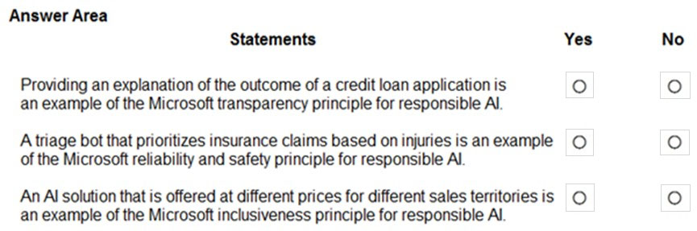

**Answer(s):** A

##### **Explanation:**

Box 1: Yes  
Achieving transparency helps the team to understand the data and algorithms used to train the model, what transformation logic was applied to the data, the final model generated, and its associated assets. This information offers insights about how the model was created, which allows it to be reproduced in a transparent way.

Box 2: No  
A data holder is obligated to protect the data in an AI system, and privacy and security are an integral part of this system. Personal needs to be secured, and it should be accessed in a way that doesn't compromise an individual's privacy.

Box 3: No  
Inclusiveness mandates that AI should consider all human races and experiences, and inclusive design practices can help developers to understand and address potential barriers that could unintentionally exclude people.  
Where possible, speech-to-text, text-to-speech, and visual recognition technology should be used to empower people with hearing, visual, and other impairments.

##### **Reference:**

https://docs.microsoft.com/en-us/azure/cloud-adoption-framework/innovate/best-practices/trusted-ai

#### **QUESTION: 20**

DRAG DROP (Drag and Drop is not supported)  
Match the principles of responsible AI to appropriate requirements.  
To answer, drag the appropriate principles from the column on the left to its requirement on the right. Each principle may be used once, more than once, or not at all. You may need to drag the split bar between panes or scroll to view content.  
Note: Each correct selection is worth one point.  
Select and Place:

**Answer(s):** A

##### **Explanation:**

##### **Reference:**

https://docs.microsoft.com/en-us/azure/cloud-adoption-framework/innovate/best-practices/trusted-ai https://docs.microsoft.com/en-us/learn/modules/responsible-ai-principles/4-guiding-principles

#### **QUESTION: 21**

DRAG DROP (Drag and Drop is not supported)  
You plan to deploy an Azure Machine Learning model as a service that will be used by client applications.  
Which three processes should you perform in sequence before you deploy the model? To answer, move the appropriate processes from the list of processes to the answer area and arrange them in the correct order.  
Select and Place:

**Answer(s):** A

##### **Explanation:**

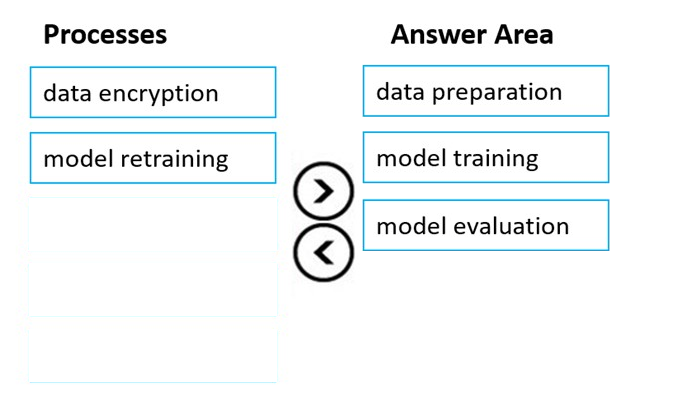

##### **Reference:**

https://docs.microsoft.com/en-us/azure/machine-learning/concept-ml-pipelines

#### **QUESTION: 22**

You are building an AI-based app.  
You need to ensure that the app uses the principles for responsible AI.  
Which two principles should you follow? Each correct answer presents part of the solution.  
Note: Each correct selection is worth one point.

1.  Implement an Agile software development methodology
2.  Implement a process of AI model validation as part of the software review process
3.  Establish a risk governance committee that includes members of the legal team, members of the risk management team, and a privacy officer
4.  Prevent the disclosure of the use of AI-based algorithms for automated decision making

**Answer(s):** B,C

##### **Reference:**

https://docs.microsoft.com/en-us/azure/cloud-adoption-framework/innovate/best-practices/trusted-ai https://docs.microsoft.com/en-us/learn/modules/responsible-ai-principles/3-implications-responsible-ai-practical

#### **QUESTION: 23**

HOTSPOT (Drag and Drop is not supported)  
To complete the sentence, select the appropriate option in the answer area.  
Hot Area:

**Answer(s):** A

##### **Explanation:**

##### **Reference:**

https://docs.microsoft.com/en-us/azure/cloud-adoption-framework/innovate/best-practices/trusted-ai

#### **QUESTION: 24**

HOTSPOT (Drag and Drop is not supported)  
Select the answer that correctly completes the sentence.  
Hot Area:

**Answer(s):** A

##### **Explanation:**

Fairness is a core ethical principle that all humans aim to understand and apply. This principle is even more important when AI systems are being developed. Key checks and balances need to make sure that the system's decisions don't discriminate or run a gender, race, sexual orientation, or religion bias toward a group or individual.

##### **Reference:**

https://docs.microsoft.com/en-us/azure/cloud-adoption-framework/innovate/best-practices/trusted-ai

#### **QUESTION: 25**

DRAG DROP (Drag and Drop is not supported)  
Match the types of AI workloads to the appropriate scenarios.  
To answer, drag the appropriate workload type from the column on the left to its scenario on the right. Each workload type may be used once, more than once, or not at all.  
Note: Each correct selection is worth one point.  
Select and Place:

**Answer(s):** A

##### **Explanation:**

Box 1: Knowledge mining  
You can use Azure Cognitive Search's knowledge mining results and populate your knowledge base of your chatbot.

Box 2: Computer vision  
Box 3: Natural language processing  
Natural language processing (NLP) is used for tasks such as sentiment analysis.

##### **Reference:**

https://docs.microsoft.com/en-us/azure/architecture/data-guide/technology-choices/natural-language-processing

#### **QUESTION: 26**

DRAG DROP (Drag and Drop is not supported)  
Match the machine learning tasks to the appropriate scenarios.  
To answer, drag the appropriate task from the column on the left to its scenario on the right. Each task may be used once, more than once, or not at all.  
Note: Each correct selection is worth one point.  
Select and Place:

**Answer(s):** A

##### **Explanation:**

Box 1: Model evaluation  
The Model evaluation module outputs a confusion matrix showing the number of true positives, false negatives, false positives, and true negatives, as well as  
ROC, Precision/Recall, and Lift curves.

Box 2: Feature engineering  
Feature engineering is the process of using domain knowledge of the data to create features that help ML algorithms learn better. In Azure Machine Learning, scaling and normalization techniques are applied to facilitate feature engineering. Collectively, these techniques and feature engineering are referred to as featurization.  
Note: Often, features are created from raw data through a process of feature engineering. For example, a time stamp in itself might not be useful for modeling until the information is transformed into units of days, months, or categories that are relevant to the problem, such as holiday versus working day.

Box 3: Feature selection  
In machine learning and statistics, feature selection is the process of selecting a subset of relevant, useful features to use in building an analytical model. Feature selection helps narrow the field of data to the most valuable inputs. Narrowing the field of data helps reduce noise and improve training performance.

##### **Reference:**

https://docs.microsoft.com/en-us/azure/machine-learning/studio/evaluate-model-performance https://docs.microsoft.com/en-us/azure/machine-learning/concept-automated-ml

#### **QUESTION: 27**

HOTSPOT (Drag and Drop is not supported)  
To complete the sentence, select the appropriate option in the answer area.  
Hot Area:

**Answer(s):** A

##### **Explanation:**

##### **Reference:**

https://www.baeldung.com/cs/feature-vs-label https://machinelearningmastery.com/discover-feature-engineering-how-to-engineer-features-and-how-to-get-good-at-it/

#### **QUESTION: 28**

You have the Predicted vs. True chart shown in the following exhibit.  

Which type of model is the chart used to evaluate?

1.  classification
2.  regression
3.  clustering

**Answer(s):** B

##### **Explanation:**

What is a Predicted vs. True chart?  
Predicted vs. True shows the relationship between a predicted value and its correlating true value for a regression problem. This graph can be used to measure performance of a model as the closer to the y=x line the predicted values are, the better the accuracy of a predictive model.

##### **Reference:**

https://docs.microsoft.com/en-us/azure/machine-learning/how-to-understand-automated-m

#### **QUESTION: 29**

Which type of machine learning should you use to predict the number of gift cards that will be sold next month?

1.  classification
2.  regression
3.  clustering

**Answer(s):** B

##### **Explanation:**

In the most basic sense, regression refers to prediction of a numeric target.  
Linear regression attempts to establish a linear relationship between one or more independent variables and a numeric outcome, or dependent variable.  
You use this module to define a linear regression method, and then train a model using a labeled dataset. The trained model can then be used to make predictions.

##### **Reference:**

https://docs.microsoft.com/en-us/azure/machine-learning/studio-module-reference/linear-regression

#### **QUESTION: 30**

You have a dataset that contains information about taxi journeys that occurred during a given period.  
You need to train a model to predict the fare of a taxi journey.  
What should you use as a feature?

1.  the number of taxi journeys in the dataset
2.  the trip distance of individual taxi journeys
3.  the fare of individual taxi journeys
4.  the trip ID of individual taxi journeys

**Answer(s):** B

##### **Explanation:**

The label is the column you want to predict. The identified Featuresare the inputs you give the model to predict the Label.  
Example:  
The provided data set contains the following columns:  
vendor_id: The ID of the taxi vendor is a feature.  
rate_code: The rate type of the taxi trip is a feature.  
passenger_count: The number of passengers on the trip is a feature. trip_time_in_secs: The amount of time the trip took. You want to predict the fare of the trip before the trip is completed. At that moment, you don't know how long the trip would take. Thus, the trip time is not a feature and you'll exclude this column from the model. trip_distance: The distance of the trip is a feature. payment_type: The payment method (cash or credit card) is a feature. fare_amount: The total taxi fare paid is the label.

##### **Reference:**

https://docs.microsoft.com/en-us/dotnet/machine-learning/tutorials/predict-prices

#### **QUESTION: 31**

You need to predict the sea level in meters for the next 10 years.  
Which type of machine learning should you use?

1.  classification
2.  regression
3.  clustering

**Answer(s):** B

##### **Explanation:**

In the most basic sense, regression refers to prediction of a numeric target.  
Linear regression attempts to establish a linear relationship between one or more independent variables and a numeric outcome, or dependent variable.  
You use this module to define a linear regression method, and then train a model using a labeled dataset. The trained model can then be used to make predictions.

##### **Reference:**

https://docs.microsoft.com/en-us/azure/machine-learning/studio-module-reference/linear-regression

#### **QUESTION: 32**

HOTSPOT (Drag and Drop is not supported)  
For each of the following statements, select Yes if the statement is true. Otherwise, select No.  
Note: Each correct selection is worth one point.  
Hot Area:

**Answer(s):** A

##### **Explanation:**

Box 1: Yes  
Automated machine learning, also referred to as automated ML or AutoML, is the process of automating the time consuming, iterative tasks of machine learning model development. It allows data scientists, analysts, and developers to build ML models with high scale, efficiency, and productivity all while sustaining model quality.

Box 2: No  
Box 3: Yes  
During training, Azure Machine Learning creates a number of pipelines in parallel that try different algorithms and parameters for you. The service iterates through  
ML algorithms paired with feature selections, where each iteration produces a model with a training score. The higher the score, the better the model is considered to "fit" your data. It will stop once it hits the exit criteria defined in the experiment.

Box 4: No  
Apply automated ML when you want Azure Machine Learning to train and tune a model for you using the target metric you specify.  
The label is the column you want to predict.

##### **Reference:**

https://azure.microsoft.com/en-us/services/machine-learning/automatedml/#features

#### **QUESTION: 33**

HOTSPOT (Drag and Drop is not supported)  
To complete the sentence, select the appropriate option in the answer area.  
Hot Area:

**Answer(s):** A

##### **Explanation:**

Two-class classification provides the answer to simple two-choice questions such as Yes/No or True/False.

#### **QUESTION: 34**

HOTSPOT (Drag and Drop is not supported)  
For each of the following statements, select Yes if the statement is true. Otherwise, select No.  
Note: Each correct selection is worth one point.  
Hot Area:

**Answer(s):** A

##### **Explanation:**

Box 1: Yes  
In machine learning, if you have labeled data, that means your data is marked up, or annotated, to show the target, which is the answer you want your machine learning model to predict.  
In general, data labeling can refer to tasks that include data tagging, annotation, classification, moderation, transcription, or processing.

Box 2: No  
Box 3: No  
Accuracy is simply the proportion of correctly classified instances. It is usually the first metric you look at when evaluating a classifier. However, when the test data is unbalanced (where most of the instances belong to one of the classes), or you are more interested in the performance on either one of the classes, accuracy doesn't really capture the effectiveness of a classifier.

##### **Reference:**

https://www.cloudfactory.com/data-labeling-guide https://docs.microsoft.com/en-us/azure/machine-learning/studio/evaluate-model-performance

#### **QUESTION: 35**

Which service should you use to extract text, key/value pairs, and table data automatically from scanned documents?

1.  Form Recognizer
2.  Text Analytics
3.  Language Understanding
4.  Custom Vision

**Answer(s):** A

##### **Explanation:**

Accelerate your business processes by automating information extraction. Form Recognizer applies advanced machine learning to accurately extract text, key/ value pairs, and tables from documents. With just a few samples, Form Recognizer tailors its understanding to your documents, both on-premises and in the cloud. Turn forms into usable data at a fraction of the time and cost, so you can focus more time acting on the information rather than compiling it.

##### **Reference:**

https://azure.microsoft.com/en-us/services/cognitive-services/form-recognizer/

#### **QUESTION: 36**

HOTSPOT (Drag and Drop is not supported)  
To complete the sentence, select the appropriate option in the answer area.  
Hot Area:

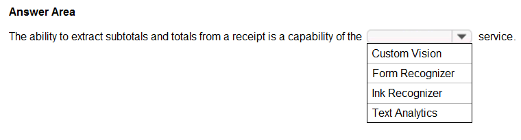

**Answer(s):** A

##### **Explanation:**

Accelerate your business processes by automating information extraction. Form Recognizer applies advanced machine learning to accurately extract text, key/ value pairs, and tables from documents. With just a few samples, Form Recognizer tailors its understanding to your documents, both on-premises and in the cloud. Turn forms into usable data at a fraction of the time and cost, so you can focus more time acting on the information rather than compiling it.

##### **Reference:**

https://azure.microsoft.com/en-us/services/cognitive-services/form-recognizer/

#### **QUESTION: 37**

You use Azure Machine Learning designer to publish an inference pipeline.  
Which two parameters should you use to access the web service? Each correct answer presents part of the solution.  
Note: Each correct selection is worth one point.

1.  the model name
2.  the training endpoint
3.  the authentication key
4.  the REST endpoint

**Answer(s):** C,D

##### **Explanation:**

You can consume a published pipeline in the Published pipelines page. Select a published pipeline and find the REST endpoint of it.  
To consume the pipeline, you need:  
\-The REST endpoint for your service  
\-The Primary Key for your service

##### **Reference:**

https://docs.microsoft.com/en-in/learn/modules/create-regression-model-azure-machine-learning-designer/deploy-service

#### **QUESTION: 38**

HOTSPOT (Drag and Drop is not supported)  
To complete the sentence, select the appropriate option in the answer area.  
Hot Area:

**Answer(s):** A

##### **Explanation:**

To perform real-time inferencing, you must deploy a pipeline as a real-time endpoint.  
Real-time endpoints must be deployed to an Azure Kubernetes Service cluster.

##### **Reference:**

https://docs.microsoft.com/en-us/azure/machine-learning/concept-designer#deploy

#### **QUESTION: 39**

HOTSPOT (Drag and Drop is not supported)  
To complete the sentence, select the appropriate option in the answer area.  
Hot Area:

**Answer(s):** A

##### **Explanation:**

In the most basic sense, regression refers to prediction of a numeric target.  
Linear regression attempts to establish a linear relationship between one or more independent variables and a numeric outcome, or dependent variable.  
You use this module to define a linear regression method, and then train a model using a labeled dataset. The trained model can then be used to make predictions.  
Incorrect Answers:  
\-Classification is a machine learning method that uses data to determine the category, type, or class of an item or row of data.  
\-Clustering, in machine learning, is a method of grouping data points into similar clusters. It is also called segmentation.  
Over the years, many clustering algorithms have been developed. Almost all clustering algorithms use the features of individual items to find similar items. For example, you might apply clustering to find similar people by demographics. You might use clustering with text analysis to group sentences with similar topics or sentiment.

##### **Reference:**

https://docs.microsoft.com/en-us/azure/machine-learning/algorithm-module-reference/linear-regression https://docs.microsoft.com/en-us/azure/machine-learning/studio-module-reference/machine-learning-initialize-model-clustering

#### **QUESTION: 40**

HOTSPOT (Drag and Drop is not supported)  
For each of the following statements, select Yes if the statement is true. Otherwise, select No.  
Note: Each correct selection is worth one point.  
Hot Area:

**Answer(s):** A

##### **Explanation:**

Box 1: Yes  
Azure Machine Learning designer lets you visually connect datasets and modules on an interactive canvas to create machine learning models.

Box 2: Yes  
With the designer you can connect the modules to create a pipeline draft.  
As you edit a pipeline in the designer, your progress is saved as a pipeline draft.

Box 3: No

##### **Reference:**

https://docs.microsoft.com/en-us/azure/machine-learning/concept-designer

#### **QUESTION: 41**

HOTSPOT (Drag and Drop is not supported)  
You have the following dataset.  

You plan to use the dataset to train a model that will predict the house price categories of houses.  
What are Household Income and House Price Category? To answer, select the appropriate option in the answer area.  
Note: Each correct selection is worth one point.  
Hot Area:

**Answer(s):** A

##### **Explanation:**

##### **Reference:**

https://docs.microsoft.com/en-us/azure/machine-learning/studio/interpret-model-results

#### **QUESTION: 42**

HOTSPOT (Drag and Drop is not supported)  
To complete the sentence, select the appropriate option in the answer area.  
Hot Area:

**Answer(s):** A

##### **Explanation:**

##### **Reference:**

https://docs.microsoft.com/en-us/azure/machine-learning/concept-designer

#### **QUESTION: 43**

HOTSPOT (Drag and Drop is not supported)  
For each of the following statements, select Yes if the statement is true. Otherwise, select No.  
Note: Each correct selection is worth one point.  
Hot Area:

**Answer(s):** A

##### **Explanation:**

##### **Reference:**

https://docs.microsoft.com/en-us/azure/machine-learning/how-to-designer-python https://docs.microsoft.com/en-us/azure/machine-learning/concept-automated-ml

#### **QUESTION: 44**

A medical research project uses a large anonymized dataset of brain scan images that are categorized into predefined brain haemorrhage types.  
You need to use machine learning to support early detection of the different brain haemorrhage types in the images before the images are reviewed by a person.  
This is an example of which type of machine learning?

1.  clustering
2.  regression
3.  classification

**Answer(s):** C

##### **Reference:**

https://docs.microsoft.com/en-us/learn/modules/create-classification-model-azure-machine-learning-designer/introduction

#### **QUESTION: 45**

When training a model, why should you randomly split the rows into separate subsets?

1.  to train the model twice to attain better accuracy
2.  to train multiple models simultaneously to attain better performance
3.  to test the model by using data that was not used to train the model

**Answer(s):** C

#### **QUESTION: 46**

You are evaluating whether to use a basic workspace or an enterprise workspace in Azure Machine Learning.  
What are two tasks that require an enterprise workspace? Each correct answer presents a complete solution.  
Note: Each correct selection is worth one point.

1.  Use a graphical user interface (GUI) to run automated machine learning experiments.
2.  Create a compute instance to use as a workstation.
3.  Use a graphical user interface (GUI) to define and run machine learning experiments from Azure Machine Learning designer.
4.  Create a dataset from a comma-separated value (CSV) file.

**Answer(s):** A,C

##### **Explanation:**

Note: Enterprise workspaces are no longer available as of September 2020. The basic workspace now has all the functionality of the enterprise workspace.

##### **Reference:**

https://www.azure.cn/en-us/pricing/details/machine-learning/  
https://docs.microsoft.com/en-us/azure/machine-learning/concept-workspace

#### **QUESTION: 47**

You need to predict the income range of a given customer by using the following dataset.

Which two fields should you use as features? Each correct answer presents a complete solution.  
Note: Each correct selection is worth one point.

1.  Education Level
2.  Last Name
3.  Age
4.  Income Range
5.  First Name

**Answer(s):** A,C

##### **Explanation:**

First Name, Last Name, Age and Education Level are features. Income range is a label (what you want to predict). First Name and Last Name are irrelevant in that they have no bearing on income. Age and Education level are the features you should use.

#### **QUESTION: 48**

You are building a tool that will process images from retail stores and identify the products of competitors.  
The solution will use a custom model.  
Which Azure Cognitive Services service should you use?

1.  Custom Vision
2.  Form Recognizer
3.  Face
4.  Computer Vision

**Answer(s):** A

##### **Reference:**

https://docs.microsoft.com/en-us/azure/cognitive-services/custom-vision-service/overview

#### **QUESTION: 49**

HOTSPOT (Drag and Drop is not supported)  
For each of the following statements, select Yes if the statement is true. Otherwise, select No.  
Note: Each correct selection is worth one point.  
Hot Area:

**Answer(s):** A

##### **Explanation:**

Clustering is a machine learning task that is used to group instances of data into clusters that contain similar characteristics. Clustering can also be used to identify relationships in a dataset  
Regression is a machine learning task that is used to predict the value of the label from a set of related features.

##### **Reference:**

https://docs.microsoft.com/en-us/dotnet/machine-learning/resources/tasks

#### **QUESTION: 50**

HOTSPOT (Drag and Drop is not supported)  
For each of the following statements, select Yes if the statement is true. Otherwise, select No.  
Note: Each correct selection is worth one point.  
Hot Area:

**Answer(s):** A

##### **Explanation:**

Box 1: No  
The validation dataset is different from the test dataset that is held back from the training of the model.

Box 2: Yes  
A validation dataset is a sample of data that is used to give an estimate of model skill while tuning model's hyperparameters.

Box 3: No  
The Test Dataset, not the validation set, used for this. The Test Dataset is a sample of data used to provide an unbiased evaluation of a final model fit on the training dataset.

##### **Reference:**

https://machinelearningmastery.com/difference-test-validation-datasets/

#### **QUESTION: 51**

What are two metrics that you can use to evaluate a regression model? Each correct answer presents a complete solution.  
Note: Each correct selection is worth one point.

1.  coefficient of determination (R2)
2.  F1 score
3.  root mean squared error (RMSE)
4.  area under curve (AUC)
5.  balanced accuracy

**Answer(s):** A,C

##### **Explanation:**

A: R-squared (R2), or Coefficient of determination represents the predictive power of the model as a value between -inf and 1.00. 1.00 means there is a perfect fit, and the fit can be arbitrarily poor so the scores can be negative.  
C: RMS-loss or Root Mean Squared Error (RMSE) (also called Root Mean Square Deviation, RMSD), measures the difference between values predicted by a model and the values observed from the environment that is being modeled.  
Incorrect Answers:  
B: F1 score also known as balanced F-score or F-measure is used to evaluate a classification model.  
D: aucROC or area under the curve (AUC) is used to evaluate a classification model.

##### **Reference:**

https://docs.microsoft.com/en-us/dotnet/machine-learning/resources/metrics

#### **QUESTION: 52**

HOTSPOT (Drag and Drop is not supported)  
To complete the sentence, select the appropriate option in the answer area.  
Hot Area:

**Answer(s):** A

##### **Explanation:**

Regression is a machine learning task that is used to predict the value of the label from a set of related features.

##### **Reference:**

https://docs.microsoft.com/en-us/dotnet/machine-learning/resources/tasks

#### **QUESTION: 53**

DRAG DROP (Drag and Drop is not supported)  
You need to use Azure Machine Learning designer to build a model that will predict automobile prices.  
Which type of modules should you use to complete the model? To answer, drag the appropriate modules to the correct locations. Each module may be used once, more than once, or not at all. You may need to drag the split bar between panes or scroll to view content.  
Note: Each correct selection is worth one point.  
Select and Place:

**Answer(s):** A

##### **Explanation:**

Box 1: Select Columns in Dataset  
For Columns to be cleaned, choose the columns that contain the missing values you want to change. You can choose multiple columns, but you must use the same replacement method in all selected columns.  
Example:

Box 2: Split data  
Splitting data is a common task in machine learning. You will split your data into two separate datasets. One dataset will train the model and the other will test how well the model performed.

Box 3: Linear regression  
Because you want to predict price, which is a number, you can use a regression algorithm. For this example, you use a linear regression model.

##### **Reference:**

https://docs.microsoft.com/en-us/azure/machine-learning/tutorial-designer-automobile-price-train-score

#### **QUESTION: 54**

Which type of machine learning should you use to identify groups of people who have similar purchasing habits?

1.  classification
2.  regression
3.  clustering

**Answer(s):** C

##### **Explanation:**

Clustering is a machine learning task that is used to group instances of data into clusters that contain similar characteristics. Clustering can also be used to identify relationships in a dataset

##### **Reference:**

https://docs.microsoft.com/en-us/dotnet/machine-learning/resources/tasks

#### **QUESTION: 55**

HOTSPOT (Drag and Drop is not supported)  
To complete the sentence, select the appropriate option in the answer area.  
Hot Area:

**Answer(s):** A

##### **Explanation:**

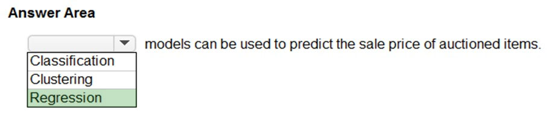

Regression is a machine learning task that is used to predict the value of the label from a set of related features.

##### **Reference:**

https://docs.microsoft.com/en-us/dotnet/machine-learning/resources/tasks

#### **QUESTION: 56**

Which metric can you use to evaluate a classification model?

1.  true positive rate
2.  mean absolute error (MAE)
3.  coefficient of determination (R2)
4.  root mean squared error (RMSE)

**Answer(s):** A

##### **Explanation:**

What does a good model look like?  
An ROC curve that approaches the top left corner with 100% true positive rate and 0% false positive rate will be the best model. A random model would display as a flat line from the bottom left to the top right corner. Worse than random would dip below the y=x line.

##### **Reference:**

https://docs.microsoft.com/en-us/azure/machine-learning/how-to-understand-automated-ml#classification

#### **QUESTION: 57**

Which two components can you drag onto a canvas in Azure Machine Learning designer? Each correct answer presents a complete solution.  
Note: Each correct selection is worth one point.

1.  dataset
2.  compute
3.  pipeline
4.  module

**Answer(s):** A,D

##### **Explanation:**

You can drag-and-drop datasets and modules onto the canvas.

##### **Reference:**

https://docs.microsoft.com/en-us/azure/machine-learning/concept-designer

#### **QUESTION: 58**

You need to create a training dataset and validation dataset from an existing dataset.  
Which module in the Azure Machine Learning designer should you use?

1.  Select Columns in Dataset
2.  Add Rows
3.  Split Data
4.  Join Data

**Answer(s):** C

##### **Explanation:**

A common way of evaluating a model is to divide the data into a training and test set by using Split Data, and then validate the model on the training data.  
Use the Split Data module to divide a dataset into two distinct sets.  
The studio currently supports training/validation data splits

##### **Reference:**

https://docs.microsoft.com/en-us/azure/machine-learning/how-to-configure-cross-validation-data-splits

#### **QUESTION: 59**

DRAG DROP (Drag and Drop is not supported)  
Match the types of machine learning to the appropriate scenarios.  
To answer, drag the appropriate machine learning type from the column on the left to its scenario on the right. Each machine learning type may be used once, more than once, or not at all.  
Note: Each correct selection is worth one point.  
Select and Place:

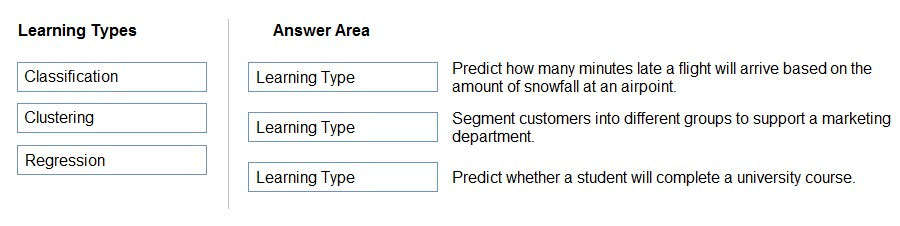

**Answer(s):** A

##### **Explanation:**

Box 1: Regression  
In the most basic sense, regression refers to prediction of a numeric target.  
Linear regression attempts to establish a linear relationship between one or more independent variables and a numeric outcome, or dependent variable.  
You use this module to define a linear regression method, and then train a model using a labeled dataset. The trained model can then be used to make predictions.

Box 2: Clustering  
Clustering, in machine learning, is a method of grouping data points into similar clusters. It is also called segmentation.  
Over the years, many clustering algorithms have been developed. Almost all clustering algorithms use the features of individual items to find similar items. For example, you might apply clustering to find similar people by demographics. You might use clustering with text analysis to group sentences with similar topics or sentiment.

Box 3: Classification  
Two-class classification provides the answer to simple two-choice questions such as Yes/No or True/False.

##### **Reference:**

https://docs.microsoft.com/en-us/azure/machine-learning/studio-module-reference/linear-regression

#### **QUESTION: 60**

HOTSPOT (Drag and Drop is not supported)  
To complete the sentence, select the appropriate option in the answer area.  
Hot Area:

**Answer(s):** A

##### **Explanation:**

##### **Reference:**

https://docs.microsoft.com/en-us/azure/cognitive-services/custom-vision-service/getting-started-build-a-classifier

#### **QUESTION: 61**

HOTSPOT (Drag and Drop is not supported)  
To complete the sentence, select the appropriate option in the answer area.  
Hot Area:

**Answer(s):** A

##### **Explanation:**

##### **Reference:**

https://docs.microsoft.com/en-us/azure/cloud-adoption-framework/innovate/best-practices/trusted-ai

#### **QUESTION: 62**

HOTSPOT (Drag and Drop is not supported)  
To complete the sentence, select the appropriate option in the answer area.  
Hot Area:

**Answer(s):** A

##### **Explanation:**

##### **Reference:**

https://docs.microsoft.com/en-us/azure/architecture/data-science-process/create-features

#### **QUESTION: 63**

HOTSPOT (Drag and Drop is not supported)  
To complete the sentence, select the appropriate option in the answer area.  
Hot Area:

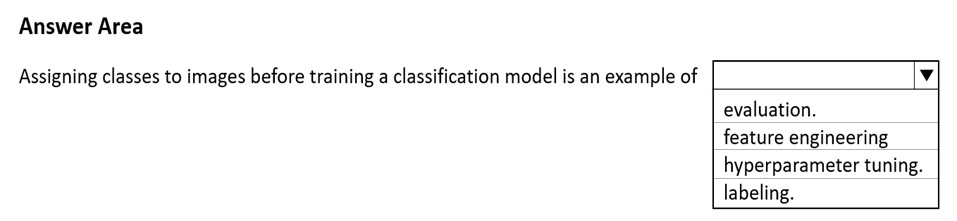

**Answer(s):** A

##### **Explanation:**

##### **Reference:**

https://docs.microsoft.com/en-us/azure/machine-learning/how-to-label-data

#### **QUESTION: 64**

HOTSPOT (Drag and Drop is not supported)  
You have an Azure Machine Learning model that predicts product quality. The model has a training dataset that contains 50,000 records. A sample of the data is shown in the following table.

For each of the following statements, select Yes if the statement is true. Otherwise, select No.  
Note: Each correct selection is worth one point.  
Hot Area:

**Answer(s):** A

##### **Explanation:**

##### **Reference:**

https://docs.microsoft.com/en-us/azure/machine-learning/component-reference/filter-based-feature-selection

#### **QUESTION: 65**

HOTSPOT (Drag and Drop is not supported)  
For each of the following statements, select Yes if the statement is true. Otherwise, select No.  
Note: Each correct selection is worth one point.  
Hot Area:

**Answer(s):** A

##### **Explanation:**

##### **Reference:**

https://docs.microsoft.com/en-us/learn/modules/create-regression-model-azure-machine-learning-designer/5-create-training-pipeline https://docs.microsoft.com/en-us/learn/modules/create-classification-model-azure-machine-learning-designer/introduction https://docs.microsoft.com/en-us/learn/modules/create-clustering-model-azure-machine-learning-designer/1-introduction

#### **QUESTION: 66**

Which two actions are performed during the data ingestion and data preparation stage of an Azure Machine Learning process? Each correct answer presents part of the solution.  
Note: Each correct selection is worth one point.

1.  Calculate the accuracy of the model.
2.  Score test data by using the model.
3.  Combine multiple datasets.
4.  Use the model for real-time predictions.
5.  Remove records that have missing values.

**Answer(s):** C,E

##### **Reference:**

https://docs.microsoft.com/en-us/azure/machine-learning/concept-data-ingestion https://docs.microsoft.com/en-us/azure/architecture/data-science-process/prepare-data

#### **QUESTION: 67**

You need to predict the animal population of an area.  
Which Azure Machine Learning type should you use?

1.  regression
2.  clustering
3.  classification

**Answer(s):** A

##### **Explanation:**

Regression is a supervised machine learning technique used to predict numeric values.

##### **Reference:**

https://docs.microsoft.com/en-us/learn/modules/create-regression-model-azure-machine-learning-designer/1-introduction

#### **QUESTION: 68**

Which two languages can you use to write custom code for Azure Machine Learning designer? Each correct answer presents a complete solution.  
Note: Each correct selection is worth one point.

1.  Python
2.  R
3.  C#
4.  Scala

**Answer(s):** A,B

##### **Explanation:**

Use Azure Machine Learning designer for customizing using Python and R code.

##### **Reference:**

https://azure.microsoft.com/en-us/services/machine-learning/designer/#features

#### **QUESTION: 69**

HOTSPOT (Drag and Drop is not supported)  
For each of the following statements, select Yes if the statement is true. Otherwise, select No.  
Note: Each correct selection is worth one point.  
Hot Area:

**Answer(s):** A

##### **Explanation:**

Box 1: Yes  
For regression problems, the label column must contain numeric data that represents the response variable. Ideally the numeric data represents a continuous scale.

Box 2: No  
K-Means Clustering  
Because the K-means algorithm is an unsupervised learning method, a label column is optional.  
If your data includes a label, you can use the label values to guide selection of the clusters and optimize the model.  
If your data has no label, the algorithm creates clusters representing possible categories, based solely on the data.

Box 3: No  
For classification problems, the label column must contain either categorical values or discrete values. Some examples might be a yes/no rating, a disease classification code or name, or an income group. If you pick a noncategorical column, the component will return an error during training.

##### **Reference:**

https://docs.microsoft.com/en-us/azure/machine-learning/component-reference/train-model https://docs.microsoft.com/en-us/azure/machine-learning/component-reference/k-means-clustering

#### **QUESTION: 70**

Your company wants to build a recycling machine for bottles. The recycling machine must automatically identify bottles of the correct shape and reject all other items.  
Which type of AI workload should the company use?

1.  anomaly detection
2.  conversational AI
3.  computer vision
4.  natural language processing

**Answer(s):** C

##### **Explanation:**

Azure's Computer Vision service gives you access to advanced algorithms that process images and return information based on the visual features you're interested in. For example, Computer Vision can determine whether an image contains adult content, find specific brands or objects, or find human faces.

##### **Reference:**

https://docs.microsoft.com/en-us/azure/cognitive-services/computer-vision/overview

#### **QUESTION: 71**

HOTSPOT (Drag and Drop is not supported)  
For each of the following statements, select Yes if the statement is true. Otherwise, select No.  
Note: Each correct selection is worth one point.  
Hot Area:

**Answer(s):** A

##### **Explanation:**

##### **Reference:**

https://docs.microsoft.com/en-us/azure/cognitive-services/custom-vision-service/get-started-build-detector

#### **QUESTION: 72**

In which two scenarios can you use the Form Recognizer service? Each correct answer presents a complete solution.  
Note: Each correct selection is worth one point.

1.  Extract the invoice number from an invoice.
2.  Translate a form from French to English.
3.  Find image of product in a catalog.
4.  Identify the retailer from a receipt.

**Answer(s):** A,D

##### **Reference:**

https://azure.microsoft.com/en-gb/services/cognitive-services/form-recognizer/#features

#### **QUESTION: 73**

HOTSPOT (Drag and Drop is not supported)  
Select the answer that correctly completes the sentence.  
Hot Area:

**Answer(s):** A

##### **Explanation:**

##### **Reference:**

https://docs.microsoft.com/en-us/azure/cognitive-services/computer-vision/overview https://docs.microsoft.com/en-us/azure/cognitive-services/computer-vision/intro-to-spatial-analysis-public-preview

#### **QUESTION: 74**

HOTSPOT (Drag and Drop is not supported)  
You have a database that contains a list of employees and their photos.  
You are tagging new photos of the employees.  
For each of the following statements select Yes if the statement is true. Otherwise, select No.  
Note: Each correct selection is worth one point.  
Hot Area:

**Answer(s):** A

##### **Explanation:**

##### **Reference:**

https://docs.microsoft.com/en-us/azure/cognitive-services/face/overview https://docs.microsoft.com/en-us/azure/cognitive-services/face/concepts/face-detection

#### **QUESTION: 75**

You need to develop a mobile app for employees to scan and store their expenses while travelling.  
Which type of computer vision should you use?

1.  semantic segmentation
2.  image classification
3.  object detection
4.  optical character recognition (OCR)

**Answer(s):** D

##### **Explanation:**

Azure's Computer Vision API includes Optical Character Recognition (OCR) capabilities that extract printed or handwritten text from images. You can extract text from images, such as photos of license plates or containers with serial numbers, as well as from documents - invoices, bills, financial reports, articles, and more.

##### **Reference:**

https://docs.microsoft.com/en-us/azure/cognitive-services/computer-vision/concept-recognizing-text

#### **QUESTION: 76**

HOTSPOT (Drag and Drop is not supported)  
For each of the following statements, select Yes if the statement is true. Otherwise, select No.  
Note: Each correct selection is worth one point.  
Hot Area:

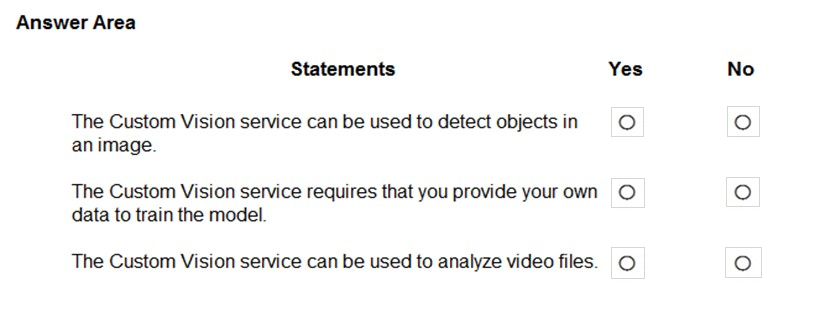

**Answer(s):** A

##### **Explanation:**

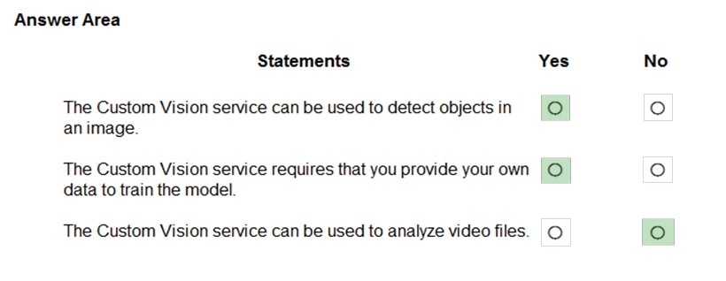

Box 1: Yes  
Custom Vision functionality can be divided into two features. Image classification applies one or more labels to an image. Object detection is similar, but it also returns the coordinates in the image where the applied label(s) can be found.

Box 2: Yes  
The Custom Vision service uses a machine learning algorithm to analyze images. You, the developer, submit groups of images that feature and lack the characteristics in question. You label the images yourself at the time of submission. Then, the algorithm trains to this data and calculates its own accuracy by testing itself on those same images.

Box 3: No  
Custom Vision service can be used only on graphic files.

##### **Reference:**

https://docs.microsoft.com/en-us/azure/cognitive-services/Custom-Vision-Service/overview

#### **QUESTION: 77**

You are processing photos of runners in a race.  
You need to read the numbers on the runners' shirts to identity the runners in the photos.  
Which type of computer vision should you use?

1.  facial recognition
2.  optical character recognition (OCR)
3.  image classification
4.  object detection

**Answer(s):** B

##### **Explanation:**

Optical character recognition (OCR) allows you to extract printed or handwritten text from images and documents.

##### **Reference:**

https://docs.microsoft.com/en-us/azure/cognitive-services/computer-vision/overview-ocr

#### **QUESTION: 78**

DRAG DROP (Drag and Drop is not supported)  
Match the types of machine learning to the appropriate scenarios.  
To answer, drag the appropriate machine learning type from the column on the left to its scenario on the right. Each machine learning type may be used once, more than once, or not at all.  
Note: Each correct selection is worth one point.  
Select and Place:

**Answer(s):** A

##### **Explanation:**

Box 1: Image classification  
Image classification is a supervised learning problem: define a set of target classes (objects to identify in images), and train a model to recognize them using labeled example photos.

Box 2: Object detection  
Object detection is a computer vision problem.  
While closely related to image classification, object detection performs image classification at a more granular scale. Object detection both locates and categorizes entities within images.

Box 3: Semantic Segmentation  
Semantic segmentation achieves fine-grained inference by making dense predictions inferring labels for every pixel, so that each pixel is labeled with the class of its enclosing object ore region.

##### **Reference:**

https://developers.google.com/machine-learning/practica/image-classification https://docs.microsoft.com/en-us/dotnet/machine-learning/tutorials/object-detection-model-builder https://nanonets.com/blog/how-to-do-semantic-segmentation-using-deep-learning/

#### **QUESTION: 79**

You use drones to identify where weeds grow between rows of crops to send an instruction for the removal of the weeds.  
This is an example of which type of computer vision?

1.  object detection
2.  optical character recognition (OCR)
3.  scene segmentation

**Answer(s):** A

##### **Explanation:**

Object detection is similar to tagging, but the API returns the bounding box coordinates for each tag applied. For example, if an image contains a dog, cat and person, the Detect operation will list those objects together with their coordinates in the image.  
Incorrect Answers:  
B: Optical character recognition (OCR) allows you to extract printed or handwritten text from images and documents.  
C: Scene segmentation determines when a scene changes in video based on visual cues. A scene depicts a single event and it's composed by a series of consecutive shots, which are semantically related.

##### **Reference:**

https://docs.microsoft.com/en-us/ai-builder/object-detection-overview https://docs.microsoft.com/en-us/azure/cognitive-services/computer-vision/overview-ocr https://docs.microsoft.com/en-us/azure/azure-video-analyzer/video-analyzer-for-media-docs/video-indexer-overview

#### **QUESTION: 80**

DRAG DROP (Drag and Drop is not supported)  
Match the facial recognition tasks to the appropriate questions.  
To answer, drag the appropriate task from the column on the left to its question on the right. Each task may be used once, more than once, or not at all.  
Note: Each correct selection is worth one point.  
Select and Place:

**Answer(s):** A

##### **Explanation:**

Box 1: verification  
Face verification: Check the likelihood that two faces belong to the same person and receive a confidence score.

Box 2: similarity  
Box 3: Grouping  
Box 4: identification  
Face detection: Detect one or more human faces along with attributes such as: age, emotion, pose, smile, and facial hair, including 27 landmarks for each face in the image.

##### **Reference:**

https://azure.microsoft.com/en-us/services/cognitive-services/face/#features

#### **QUESTION: 81**

DRAG DROP (Drag and Drop is not supported)  
Match the types of computer vision workloads to the appropriate scenarios.  
To answer, drag the appropriate workload type from the column on the left to its scenario on the right. Each workload type may be used once, more than once, or not at all.  
Note: Each correct selection is worth one point.  
Select and Place:

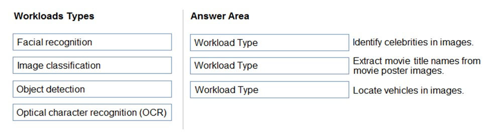

**Answer(s):** A

##### **Explanation:**

Box 1: Facial recognition  
Face detection that perceives faces and attributes in an image; person identification that matches an individual in your private repository of up to 1 million people; perceived emotion recognition that detects a range of facial expressions like happiness, contempt, neutrality, and fear; and recognition and grouping of similar faces in images.

Box 2: OCR  
Box 3: Objection detection  
Object detection is similar to tagging, but the API returns the bounding box coordinates (in pixels) for each object found. For example, if an image contains a dog, cat and person, the Detect operation will list those objects together with their coordinates in the image. You can use this functionality to process the relationships between the objects in an image. It also lets you determine whether there are multiple instances of the same tag in an image.  
The Detect API applies tags based on the objects or living things identified in the image. There is currently no formal relationship between the tagging taxonomy and the object detection taxonomy. At a conceptual level, the Detect API only finds objects and living things, while the Tag API can also include contextual terms like "indoor", which can't be localized with bounding boxes.

##### **Reference:**

https://azure.microsoft.com/en-us/services/cognitive-services/face/ https://docs.microsoft.com/en-us/azure/cognitive-services/computer-vision/concept-object-detection

#### **QUESTION: 82**

You need to determine the location of cars in an image so that you can estimate the distance between the cars.  
Which type of computer vision should you use?

1.  optical character recognition (OCR)
2.  object detection
3.  image classification
4.  face detection

**Answer(s):** B

##### **Explanation:**

Object detection is similar to tagging, but the API returns the bounding box coordinates (in pixels) for each object found. For example, if an image contains a dog, cat and person, the Detect operation will list those objects together with their coordinates in the image. You can use this functionality to process the relationships between the objects in an image. It also lets you determine whether there are multiple instances of the same tag in an image.  
The Detect API applies tags based on the objects or living things identified in the image. There is currently no formal relationship between the tagging taxonomy and the object detection taxonomy. At a conceptual level, the Detect API only finds objects and living things, while the Tag API can also include contextual terms like "indoor", which can't be localized with bounding boxes.

##### **Reference:**

https://docs.microsoft.com/en-us/azure/cognitive-services/computer-vision/concept-object-detection

#### **QUESTION: 83**

HOTSPOT (Drag and Drop is not supported)  
To complete the sentence, select the appropriate option in the answer area.  
Hot Area:

**Answer(s):** A

##### **Explanation:**

Azure Custom Vision is a cognitive service that lets you build, deploy, and improve your own image classifiers. An image classifier is an AI service that applies labels (which represent classes) to images, according to their visual characteristics. Unlike the Computer Vision service, Custom Vision allows you to specify the labels to apply.  
Note: The Custom Vision service uses a machine learning algorithm to apply labels to images. You, the developer, must submit groups of images that feature and lack the characteristics in question. You label the images yourself at the time of submission. Then the algorithm trains to this data and calculates its own accuracy by testing itself on those same images. Once the algorithm is trained, you can test, retrain, and eventually use it to classify new images according to the needs of your app. You can also export the model itself for offline use.  
Incorrect Answers:  
Computer Vision:  
Azure's Computer Vision service provides developers with access to advanced algorithms that process images and return information based on the visual features you're interested in. For example, Computer Vision can determine whether an image contains adult content, find specific brands or objects, or find human faces.

##### **Reference:**

https://docs.microsoft.com/en-us/azure/cognitive-services/custom-vision-service/home

#### **QUESTION: 84**

You send an image to a Computer Vision API and receive back the annotated image shown in the exhibit.

Which type of computer vision was used?

1.  object detection
2.  face detection
3.  optical character recognition (OCR)
4.  image classification

**Answer(s):** A

##### **Explanation:**

Object detection is similar to tagging, but the API returns the bounding box coordinates (in pixels) for each object found. For example, if an image contains a dog, cat and person, the Detect operation will list those objects together with their coordinates in the image. You can use this functionality to process the relationships between the objects in an image. It also lets you determine whether there are multiple instances of the same tag in an image.  
The Detect API applies tags based on the objects or living things identified in the image. There is currently no formal relationship between the tagging taxonomy and the object detection taxonomy. At a conceptual level, the Detect API only finds objects and living things, while the Tag API can also include contextual terms like "indoor", which can't be localized with bounding boxes.

##### **Reference:**

https://docs.microsoft.com/en-us/azure/cognitive-services/computer-vision/concept-object-detection

#### **QUESTION: 85**

What are two tasks that can be performed by using the Computer Vision service? Each correct answer presents a complete solution.  
Note: Each correct selection is worth one point.

1.  Train a custom image classification model.
2.  Detect faces in an image.
3.  Recognize handwritten text.
4.  Translate the text in an image between languages.

**Answer(s):** B,C

##### **Explanation:**

B: Azure's Computer Vision service provides developers with access to advanced algorithms that process images and return information based on the visual features you're interested in. For example, Computer Vision can determine whether an image contains adult content, find specific brands or objects, or find human faces.  
C: Computer Vision includes Optical Character Recognition (OCR) capabilities. You can use the new Read API to extract printed and handwritten text from images and documents.

##### **Reference:**

https://docs.microsoft.com/en-us/azure/cognitive-services/computer-vision/home

#### **QUESTION: 86**

What is a use case for classification?

1.  predicting how many cups of coffee a person will drink based on how many hours the person slept the previous night.
2.  analyzing the contents of images and grouping images that have similar colors
3.  predicting whether someone uses a bicycle to travel to work based on the distance from home to work
4.  predicting how many minutes it will take someone to run a race based on past race times

**Answer(s):** C

##### **Explanation:**

Two-class classification provides the answer to simple two-choice questions such as Yes/No or True/False.  
Incorrect Answers:  
A: This is Regression.  
B: This is Clustering.  
D: This is Regression.

##### **Reference:**

https://docs.microsoft.com/en-us/azure/machine-learning/algorithm-module-reference/linear-regression https://docs.microsoft.com/en-us/azure/machine-learning/studio-module-reference/machine-learning-initialize-model-clustering

#### **QUESTION: 87**

What are two tasks that can be performed by using computer vision? Each correct answer presents a complete solution.  
Note: Each correct selection is worth one point.

1.  Predict stock prices.
2.  Detect brands in an image.
3.  Detect the color scheme in an image
4.  Translate text between languages.
5.  Extract key phrases.

**Answer(s):** B,C

##### **Explanation:**

B: Identify commercial brands in images or videos from a database of thousands of global logos. You can use this feature, for example, to discover which brands are most popular on social media or most prevalent in media product placement.  
C: Analyze color usage within an image. Computer Vision can determine whether an image is black & white or color and, for color images, identify the dominant and accent colors.

##### **Reference:**

https://docs.microsoft.com/en-us/azure/cognitive-services/computer-vision/overview

#### **QUESTION: 88**

You need to build an image tagging solution for social media that tags images of your friends automatically.  
Which Azure Cognitive Services service should you use?

1.  Face
2.  Form Recognizer
3.  Text Analytics
4.  Computer Vision

**Answer(s):** A

##### **Reference:**

https://docs.microsoft.com/en-us/azure/cognitive-services/face/overview https://docs.microsoft.com/en-us/azure/cognitive-services/face/face-api-how-to-topics/howtodetectfacesinimage

#### **QUESTION: 89**

In which two scenarios can you use the Form Recognizer service? Each correct answer presents a complete solution.  
Note: Each correct selection is worth one point.

1.  Identify the retailer from a receipt
2.  Translate from French to English
3.  Extract the invoice number from an invoice
4.  Find images of products in a catalog

**Answer(s):** A,C

##### **Reference:**

https://docs.microsoft.com/en-us/azure/applied-ai-services/form-recognizer/overview?tabs=v2-1

#### **QUESTION: 90**

DRAG DROP (Drag and Drop is not supported)  
Match the facial recognition tasks to the appropriate questions.  
To answer, drag the appropriate task from the column on the left to its question on the right.  
Each task may be used once, more than once, or not at all.  
Note: Each correct selection is worth one point.  
Select and Place:

**Answer(s):** A

##### **Explanation:**

Box 1: verification

Identity verification  
Modern enterprises and apps can use the Face identification and Face verification operations to verify that a user is who they claim to be.

Box 2: similarity  
The Find Similar operation does face matching between a target face and a set of candidate faces, finding a smaller set of faces that look similar to the target face.  
This is useful for doing a face search by image.  
The service supports two working modes, matchPerson and matchFace. The matchPerson mode returns similar faces after filtering for the same person by using the Verify API. The matchFace mode ignores the same-person filter. It returns a list of similar candidate faces that may or may not belong to the same person.

Box 3: identification  
Face identification can address "one-to-many" matching of one face in an image to a set of faces in a secure repository. Match candidates are returned based on how closely their face data matches the query face. This scenario is used in granting building or airport access to a certain group of people or verifying the user of a device.

##### **Reference:**

https://docs.microsoft.com/en-us/azure/cognitive-services/face/overview

#### **QUESTION: 91**

Which Computer Vision feature can you use to generate automatic captions for digital photographs?

1.  Recognize text.
2.  Identify the areas of interest.
3.  Detect objects.
4.  Describe the images.

**Answer(s):** D

##### **Explanation:**

Describe images with human-readable language  
Computer Vision can analyze an image and generate a human-readable phrase that describes its contents. The algorithm returns several descriptions based on different visual features, and each description is given a confidence score. The final output is a list of descriptions ordered from highest to lowest confidence.  
The image description feature is part of the Analyze Image API.

##### **Reference:**

https://docs.microsoft.com/en-us/azure/cognitive-services/computer-vision/concept-describing-images

#### **QUESTION: 92**

Which service should you use to extract text, key/value pairs, and table data automatically from scanned documents?

1.  Custom Vision
2.  Face
3.  Form Recognizer
4.  Language

**Answer(s):** C

##### **Explanation:**

Form Recognizer applies advanced machine learning to accurately extract text, key-value pairs, tables, and structures from documents.

##### **Reference:**

https://azure.microsoft.com/en-us/services/form-recognizer/

#### **QUESTION: 93**

HOTSPOT (Drag and Drop is not supported)  
Select the answer that correctly completes the sentence.  
Hot Area:

**Answer(s):** A

##### **Explanation:**

Handwriting OCR (optical character recognition) is the process of automatically extracting handwritten information from paper, scans and other low-quality digital documents.

##### **Reference:**

https://vidado.ai/handwriting-ocr

#### **QUESTION: 94**

You are developing a solution that uses the Text Analytics service.  
You need to identify the main talking points in a collection of documents.  
Which type of natural language processing should you use?

1.  entity recognition
2.  key phrase extraction
3.  sentiment analysis
4.  language detection

**Answer(s):** B

##### **Explanation:**

Broad entity extraction: Identify important concepts in text, including key  
Key phrase extraction/ Broad entity extraction: Identify important concepts in text, including key phrases and named entities such as people, places, and organizations.

##### **Reference:**

https://docs.microsoft.com/en-us/azure/architecture/data-guide/technology-choices/natural-language-processing

#### **QUESTION: 95**

In which two scenarios can you use speech recognition? Each correct answer presents a complete solution.  
Note: Each correct selection is worth one point.

1.  an in-car system that reads text messages aloud
2.  providing closed captions for recorded or live videos
3.  creating an automated public address system for a train station
4.  creating a transcript of a telephone call or meeting

**Answer(s):** B,D

##### **Reference:**

https://azure.microsoft.com/en-gb/services/cognitive-services/speech-to-text/#features

#### **QUESTION: 96**

HOTSPOT (Drag and Drop is not supported)  
To complete the sentence, select the appropriate option in the answer area.  
Hot Area:

**Answer(s):** A

##### **Explanation:**

##### **Reference:**

https://azure.microsoft.com/en-gb/services/cognitive-services/speech-to-text/#features

#### **QUESTION: 97**

You need to build an app that will read recipe instructions aloud to support users who have reduced vision.  
Which version service should you use?

1.  Text Analytics
2.  Translator
3.  Speech
4.  Language Understanding (LUIS)

**Answer(s):** C

##### **Reference:**

https://azure.microsoft.com/en-us/services/cognitive-services/text-to-speech/#features

#### **QUESTION: 98**

HOTSPOT (Drag and Drop is not supported)  
For each of the following statements, select Yes if the statement is true. Otherwise, select No.  
Note: Each correct selection is worth one point.  
Hot Area:

**Answer(s):** A

##### **Explanation:**

##### **Reference:**

https://docs.microsoft.com/en-gb/azure/cognitive-services/text-analytics/overview https://azure.microsoft.com/en-gb/services/cognitive-services/speech-services/

#### **QUESTION: 99**

Your website has a chatbot to assist customers.  
You need to detect when a customer is upset based on what the customer types in the chatbot.  
Which type of AI workload should you use?

1.  anomaly detection
2.  computer vision
3.  regression
4.  natural language processing

**Answer(s):** D

##### **Explanation:**

Natural language processing (NLP) is used for tasks such as sentiment analysis, topic detection, language detection, key phrase extraction, and document categorization.  
Sentiment Analysis is the process of determining whether a piece of writing is positive, negative or neutral.

##### **Reference:**

https://docs.microsoft.com/en-us/azure/architecture/data-guide/technology-choices/natural-language-processing

#### **QUESTION: 100**

You plan to develop a bot that will enable users to query a knowledge base by using natural language processing.  
Which two services should you include in the solution? Each correct answer presents part of the solution.  
Note: Each correct selection is worth one point.

1.  QnA Maker
2.  Azure Bot Service
3.  Form Recognizer
4.  Anomaly Detector

**Answer(s):** A,B

##### **Reference:**

https://docs.microsoft.com/en-us/azure/bot-service/bot-service-overview-introduction?view=azure-bot-service-4.0  
https://docs.microsoft.com/en-us/azure/cognitive-services/luis/choose-natural-language-processing-service

#### **QUESTION: 101**

In which two scenarios can you use a speech synthesis solution? Each correct answer presents a complete solution.  
Note: Each correct selection is worth one point.

1.  an automated voice that reads back a credit card number entered into a telephone by using a numeric keypad
2.  generating live captions for a news broadcast
3.  extracting key phrases from the audio recording of a meeting
4.  an AI character in a computer game that speaks audibly to a player

**Answer(s):** A,D

##### **Explanation:**

Azure Text to Speech is a Speech service feature that converts text to lifelike speech.  
Incorrect Answers:  
C: Extracting key phrases is not speech synthesis.

##### **Reference:**

https://azure.microsoft.com/en-in/services/cognitive-services/text-to-speech/

#### **QUESTION: 102**

HOTSPOT (Drag and Drop is not supported)  
For each of the following statements, select Yes if the statement is true. Otherwise, select No.  
Note: Each correct selection is worth one point.  
Hot Area:

**Answer(s):** A

##### **Explanation:**

The translator service provides multi-language support for text translation, transliteration, language detection, and dictionaries.  
Speech-to-Text, also known as automatic speech recognition (ASR), is a feature of Speech Services that provides transcription.

##### **Reference:**

https://docs.microsoft.com/en-us/azure/cognitive-services/Translator/translator-info-overview https://docs.microsoft.com/en-us/legal/cognitive-services/speech-service/speech-to-text/transparency-note

#### **QUESTION: 103**

DRAG DROP (Drag and Drop is not supported)  
You need to scan the news for articles about your customers and alert employees when there is a negative article. Positive articles must be added to a press book.  
Which natural language processing tasks should you use to complete the process? To answer, drag the appropriate tasks to the correct locations. Each task may be used once, more than once, or not at all. You may need to drag the split bar between panes or scroll to view content.  
Note: Each correct selection is worth one point.  
Select and Place:

**Answer(s):** A

##### **Explanation:**

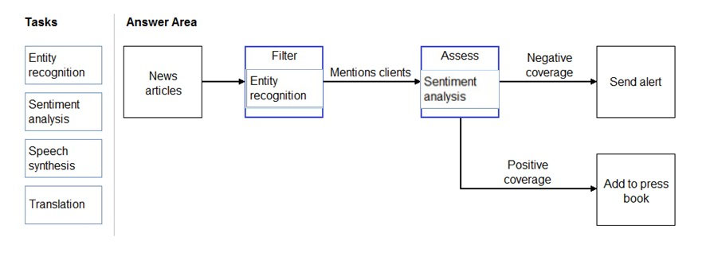

Box 1: Entity recognition the Named Entity Recognition module in Machine Learning Studio (classic), to identify the names of things, such as people, companies, or locations in a column of text.  
Named entity recognition is an important area of research in machine learning and natural language processing (NLP), because it can be used to answer many real-world questions, such as:

\-Which companies were mentioned in a news article?  
\-Does a tweet contain the name of a person? Does the tweet also provide his current location?  
\-Were specified products mentioned in complaints or reviews?

Box 2: Sentiment Analysis  
The Text Analytics API's Sentiment Analysis feature provides two ways for detecting positive and negative sentiment. If you send a Sentiment Analysis request, the API will return sentiment labels (such as "negative", "neutral" and "positive") and confidence scores at the sentence and document-level.

##### **Reference:**

https://docs.microsoft.com/en-us/azure/machine-learning/studio-module-reference/named-entity-recognition https://docs.microsoft.com/en-us/azure/cognitive-services/text-analytics/how-tos/text-analytics-how-to-sentiment-analysis

#### **QUESTION: 104**

You are building a knowledge base by using QnA Maker.  
Which file format can you use to populate the knowledge base?

1.  PPTX
2.  XML
3.  ZIP
4.  PDF

**Answer(s):** D

##### **Explanation:**

D: Content types of documents you can add to a knowledge base:  
Content types include many standard structured documents such as PDF, DOC, and TXT.  
Note: The tool supports the following file formats for ingestion:  
\-.tsv: QnA contained in the format Question(tab)Answer.  
\-.txt, .docx, .pdf: QnA contained as regular FAQ content--that is, a sequence of questions and answers.  
Incorrect Answers:  
A: PPTX is the default presentation file format for new PowerPoint presentations.  
B: It is not possible to ingest xml file directly.

##### **Reference:**

https://docs.microsoft.com/en-us/azure/cognitive-services/qnamaker/concepts/data-sources-and-content

#### **QUESTION: 105**

In which scenario should you use key phrase extraction?

1.  identifying whether reviews of a restaurant are positive or negative
2.  generating captions for a video based on the audio track
3.  identifying which documents provide information about the same topics
4.  translating a set of documents from English to German

**Answer(s):** C

#### **QUESTION: 106**

You have insurance claim reports that are stored as text.  
You need to extract key terms from the reports to generate summaries.  
Which type of AI workload should you use?

1.  natural language processing
2.  conversational AI
3.  anomaly detection
4.  computer vision

**Answer(s):** A

##### **Reference:**

https://docs.microsoft.com/en-us/azure/architecture/data-guide/technology-choices/natural-language-processing

#### **QUESTION: 107**

HOTSPOT (Drag and Drop is not supported)  
To complete the sentence, select the appropriate option in the answer area.  
Hot Area:

**Answer(s):** A

##### **Explanation:**

Natural language processing (NLP) is used for tasks such as sentiment analysis, topic detection, language detection, key phrase extraction, and document categorization.

##### **Reference:**

https://docs.microsoft.com/en-us/azure/architecture/data-guide/technology-choices/natural-language-processing

#### **QUESTION: 108**

Which AI service can you use to interpret the meaning of a user input such as \`Call me back later?\`

1.  Translator
2.  Text Analytics
3.  Speech
4.  Language Understanding (LUIS)

**Answer(s):** D

##### **Explanation:**

Language Understanding (LUIS) is a cloud-based AI service, that applies custom machine-learning intelligence to a user's conversational, natural language text to predict overall meaning, and pull out relevant, detailed information.

##### **Reference:**

https://docs.microsoft.com/en-us/azure/cognitive-services/luis/what-is-luis

#### **QUESTION: 109**

You are developing a chatbot solution in Azure.  
Which service should you use to determine a user's intent?

1.  Translator
2.  QnA Maker
3.  Speech
4.  Language Understanding (LUIS)

**Answer(s):** D

##### **Explanation:**

Language Understanding (LUIS) is a cloud-based API service that applies custom machine-learning intelligence to a user's conversational, natural language text to predict overall meaning, and pull out relevant, detailed information.  
Design your LUIS model with categories of user intentions called intents. Each intent needs examples of user utterances. Each utterance can provide data that needs to be extracted with machine-learning entities.

##### **Reference:**

https://docs.microsoft.com/en-us/azure/cognitive-services/luis/what-is-luis

#### **QUESTION: 110**

You need to make the written press releases of your company available in a range of languages.  
Which service should you use?

1.  Translator
2.  Text Analytics
3.  Speech
4.  Language Understanding (LUIS)

**Answer(s):** A

##### **Explanation:**

Translator is a cloud-based machine translation service you can use to translate text in near real-time through a simple REST API call. The service uses modern neural machine translation technology and offers statistical machine translation technology. Custom Translator is an extension of Translator, which allows you to build neural translation systems.

##### **Reference:**

https://docs.microsoft.com/en-us/azure/cognitive-services/translator/

#### **QUESTION: 111**

HOTSPOT (Drag and Drop is not supported)  
For each of the following statements, select Yes if the statement is true. Otherwise, select No.  
Note: Each correct selection is worth one point.  
Hot Area:

**Answer(s):** A

##### **Explanation:**

The Text Analytics API is a cloud-based service that provides advanced natural language processing over raw text, and includes four main functions: sentiment analysis, key phrase extraction, named entity recognition, and language detection.

Box 1: Yes  
You can detect which language the input text is written in and report a single language code for every document submitted on the request in a wide range of languages, variants, dialects, and some regional/cultural languages. The language code is paired with a score indicating the strength of the score.

Box 2: No  
Box 3: Yes  
Named Entity Recognition: Identify and categorize entities in your text as people, places, organizations, date/time, quantities, percentages, currencies, and more.  
Well-known entities are also recognized and linked to more information on the web.

##### **Reference:**

https://docs.microsoft.com/en-us/azure/cognitive-services/text-analytics/overview

#### **QUESTION: 112**

DRAG DROP (Drag and Drop is not supported)  
Match the types of natural languages processing workloads to the appropriate scenarios.  
To answer, drag the appropriate workload type from the column on the left to its scenario on the right. Each workload type may be used once, more than once, or not at all.  
Note: Each correct selection is worth one point.  
Select and Place:

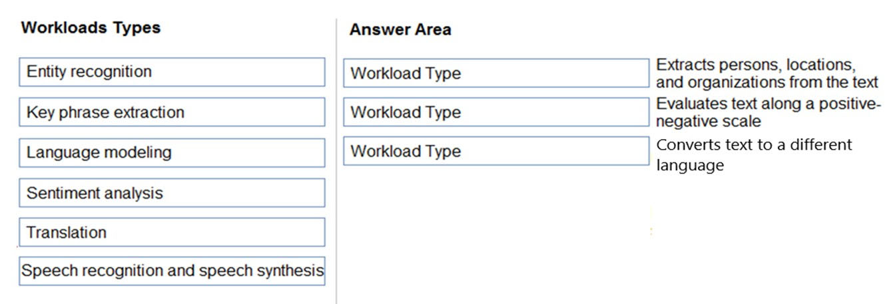

**Answer(s):** A

##### **Explanation:**

Box 1: Entity recognition  
Named Entity Recognition (NER) is the ability to identify different entities in text and categorize them into pre-defined classes or types such as: person, location, event, product, and organization.

Box 2: Sentiment analysis  
Sentiment Analysis is the process of determining whether a piece of writing is positive, negative or neutral.

Box 3: Translation  
Using Microsoft's Translator text API  
This versatile API from Microsoft can be used for the following:  
Translate text from one language to another.  
Transliterate text from one script to another.  
Detecting language of the input text.  
Find alternate translations to specific text.  
Determine the sentence length.

##### **Reference:**

https://docs.microsoft.com/en-in/azure/cognitive-services/text-analytics/how-tos/text-analytics-how-to-entity-linking?tabs=version-3-preview https://azure.microsoft.com/en-us/services/cognitive-services/text-analytics

#### **QUESTION: 113**

HOTSPOT (Drag and Drop is not supported)  
For each of the following statements, select Yes if the statement is true. Otherwise, select No.  
Note: Each correct selection is worth one point.  
Hot Area:

**Answer(s):** A

##### **Explanation:**

Box 1: Yes  
Content Moderator is part of Microsoft Cognitive Services allowing businesses to use machine assisted moderation of text, images, and videos that augment human review.  
The text moderation capability now includes a new machine-learning based text classification feature which uses a trained model to identify possible abusive, derogatory or discriminatory language such as slang, abbreviated words, offensive, and intentionally misspelled words for review.

Box 2: No  
Azure's Computer Vision service gives you access to advanced algorithms that process images and return information based on the visual features you're interested in. For example, Computer Vision can determine whether an image contains adult content, find specific brands or objects, or find human faces.

Box 3: Yes  
Natural language processing (NLP) is used for tasks such as sentiment analysis, topic detection, language detection, key phrase extraction, and document categorization.  
Sentiment Analysis is the process of determining whether a piece of writing is positive, negative or neutral.

##### **Reference:**

https://azure.microsoft.com/es-es/blog/machine-assisted-text-classification-on-content-moderator-public-preview/  
https://docs.microsoft.com/en-us/azure/architecture/data-guide/technology-choices/natural-language-processing

#### **QUESTION: 114**

You are developing a natural language processing solution in Azure. The solution will analyze customer reviews and determine how positive or negative each review is.  
This is an example of which type of natural language processing workload?

1.  language detection
2.  sentiment analysis
3.  key phrase extraction
4.  entity recognition

**Answer(s):** B

##### **Explanation:**

Sentiment Analysis is the process of determining whether a piece of writing is positive, negative or neutral.

##### **Reference:**

https://docs.microsoft.com/en-us/azure/architecture/data-guide/technology-choices/natural-language-processing

#### **QUESTION: 115**

You use natural language processing to process text from a Microsoft news story.  
You receive the output shown in the following exhibit.

Which type of natural languages processing was performed?

1.  entity recognition
2.  key phrase extraction
3.  sentiment analysis
4.  translation

**Answer(s):** A

##### **Explanation:**

Named Entity Recognition (NER) is the ability to identify different entities in text and categorize them into pre-defined classes or types such as: person, location, event, product, and organization.  
In this question, the square brackets indicate the entities such as DateTime, PersonType, Skill.

##### **Reference:**

https://docs.microsoft.com/en-in/azure/cognitive-services/text-analytics/how-tos/text-analytics-how-to-entity-linking?tabs=version-3-preview

#### **QUESTION: 116**

DRAG DROP (Drag and Drop is not supported)  
You plan to apply Text Analytics API features to a technical support ticketing system.  
Match the Text Analytics API features to the appropriate natural language processing scenarios.  
To answer, drag the appropriate feature from the column on the left to its scenario on the right. Each feature may be used once, more than once, or not at all.  
Note: Each correct selection is worth one point.  
Select and Place:

**Answer(s):** A

##### **Explanation:**

Box1: Sentiment analysis  
Sentiment Analysis is the process of determining whether a piece of writing is positive, negative or neutral.

Box 2: Broad entity extraction  
Broad entity extraction: Identify important concepts in text, including key  
Key phrase extraction/ Broad entity extraction: Identify important concepts in text, including key phrases and named entities such as people, places, and organizations.

Box 3: Entity Recognition  
Named Entity Recognition: Identify and categorize entities in your text as people, places, organizations, date/time, quantities, percentages, currencies, and more.  
Well-known entities are also recognized and linked to more information on the web.

##### **Reference:**

https://docs.microsoft.com/en-us/azure/architecture/data-guide/technology-choices/natural-language-processing https://azure.microsoft.com/en-us/services/cognitive-services/text-analytics

#### **QUESTION: 117**

You are authoring a Language Understanding (LUIS) application to support a music festival.  
You want users to be able to ask questions about scheduled shows, such as: \`Which act is playing on the main stage?\`  
The question \`Which act is playing on the main stage?\` is an example of which type of element?

1.  an intent
2.  an utterance
3.  a domain
4.  an entity

**Answer(s):** B

##### **Explanation:**

Utterances are input from the user that your app needs to interpret.

##### **Reference:**

https://docs.microsoft.com/en-us/azure/cognitive-services/LUIS/luis-concept-utterance

#### **QUESTION: 118**

You build a QnA Maker bot by using a frequently asked questions (FAQ) page.  
You need to add professional greetings and other responses to make the bot more user friendly.  
What should you do?

1.  Increase the confidence threshold of responses
2.  Enable active learning
3.  Create multi-turn questions
4.  Add chit-chat

**Answer(s):** D

##### **Reference:**

https://docs.microsoft.com/en-us/azure/cognitive-services/qnamaker/how-to/chit-chat-knowledge-base?tabs=v1

#### **QUESTION: 119**

You need to develop a chatbot for a website. The chatbot must answer users' questions based on the information in the following documents:

\-A product troubleshooting guide in a Microsoft Word document  
\-A frequently asked questions (FAQ) list on a webpage

Which service should you use to process the documents?

1.  Azure Bot Service
2.  Language Understanding
3.  Text Analytics
4.  QnA Maker

**Answer(s):** D

##### **Reference:**

https://docs.microsoft.com/en-us/azure/cognitive-services/QnAMaker/Overview/overview

#### **QUESTION: 120**

You are building a Language Understanding model for an e-commerce business.  
You need to ensure that the model detects when utterances are outside the intended scope of the model.  
What should you do?

1.  Test the model by using new utterances
2.  Add utterances to the None intent
3.  Create a prebuilt task entity
4.  Create a new model

**Answer(s):** B

##### **Explanation:**

The None intent is filled with utterances that are outside of your domain.

##### **Reference:**

https://docs.microsoft.com/en-us/azure/cognitive-services/LUIS/luis-concept-intent

#### **QUESTION: 121**

Which two scenarios are examples of a natural language processing workload? Each correct answer presents a complete solution.  
Note: Each correct selection is worth one point.

1.  monitoring the temperature of machinery to turn on a fan when the temperature reaches a specific threshold
2.  a smart device in the home that responds to questions such as, "What will the weather be like today?"
3.  a website that uses a knowledge base to interactively respond to users' questions
4.  assembly line machinery that autonomously inserts headlamps into cars

**Answer(s):** B,C

##### **Explanation:**

Natural language processing (NLP) is used for tasks such as sentiment analysis, topic detection, language detection, key phrase extraction, and document categorization.

##### **Reference:**

https://docs.microsoft.com/en-us/azure/architecture/data-guide/technology-choices/natural-language-processing

#### **QUESTION: 122**

You have an AI solution that provides users with the ability to control smart devices by using verbal commands.  
Which two types of natural language processing (NLP) workloads does the solution use? Each correct answer presents part of the solution.  
Note: Each correct selection is worth one point.

1.  text-to-speech
2.  key phrase extraction
3.  speech-to-text
4.  language modeling
5.  translation

**Answer(s):** B,C

##### **Explanation:**

Key phrase extraction is one of the features offered by Azure Cognitive Service for Language, a collection of machine learning and AI algorithms in the cloud for developing intelligent applications that involve written language. Use key phrase extraction to quickly identify the main concepts in text. For example, in the text  
"The food was delicious and the staff were wonderful.", key phrase extraction will return the main topics: "food" and "wonderful staff".

##### **Reference:**

https://docs.microsoft.com/en-us/azure/cognitive-services/language-service/key-phrase-extraction/overview

#### **QUESTION: 123**

HOTSPOT (Drag and Drop is not supported)  
For each of the following statements, select Yes if the statement is true. Otherwise, select No.  
Note: Each correct selection is worth one point.  
Hot Area:

**Answer(s):** A

##### **Explanation:**

Box 1: Yes  
Azure Cognitive Service for Language provides features including:  
\* Language detection: This pre-configured feature evaluates text, and determines the language it was written in. It returns a language identifier and a score that indicates the strength of the analysis.

Box 2: No  
Handwritten detection is part of OCR (Optical Character Recognition).

Box 3: Yes  
Azure Cognitive Service for Language provides features including:  
\* Named Entity Recognition (NER): This pre-configured feature identifies entities in text across several pre-defined categories.  
Note: Named entity recognition is a natural language processing technique that can automatically scan entire articles and pull out some fundamental entities in a text and classify them into predefined categories. Entities may be,  
Organizations,  
Quantities,  
Monetary values,  
Percentages, and more.  
People's names  
Company names  
Geographic locations (Both physical and political)  
Product names  
Dates and times  
Amounts of money  
Names of events

##### **Reference:**

https://docs.microsoft.com/en-us/azure/cognitive-services/language-service/overview

#### **QUESTION: 124**

DRAG DROP (Drag and Drop is not supported)  
You plan to use Azure Cognitive Services to develop a voice controlled personal assistant app.  
Match the Azure Cognitive Services to the appropriate tasks.  
To answer, drag the appropriate service from the column on the left to its description on the right. Each service may be used once, more than once, or not at all.  
Note: Each correct selection is worth one point.  
Select and Place:

**Answer(s):** A

##### **Explanation:**

Box 1: Speech  
The Speech service provides speech-to-text and text-to-speech capabilities with an Azure Speech resource. You can transcribe speech to text with high accuracy, produce natural-sounding text-to-speech voices, translate spoken audio, and use speaker recognition during conversations.

Box 2: Language service  
Build applications with conversational language understanding, a Cognitive Service for Language feature that understands natural language to interpret user goals and extracts key information from conversational phrases. Create multilingual, customizable intent classification and entity extraction models for your domain- specific keywords or phrases across 96 languages.

Box 3: Speech  
Incorrect:  
Not Translator text: Text translation is a cloud-based REST API feature of the Translator service that uses neural machine translation technology to enable quick and accurate source-to-target text translation in real time across all supported languages.

##### **Reference:**

https://docs.microsoft.com/en-us/azure/cognitive-services/speech-service/overview https://azure.microsoft.com/en-us/services/cognitive-services/conversational-language-understanding/  
https://docs.microsoft.com/en-us/azure/cognitive-services/translator/text-translation-overview

#### **QUESTION: 125**

You need to make the written press releases of your company available in a range of languages.  
Which service should you use?

1.  Speech
2.  Language
3.  Translator
4.  Personalizer

**Answer(s):** C

##### **Explanation:**

Translator, an AI service for real-time document and text translation.  
Translate text instantly or in batches across more than 100 languages, powered by the latest innovations in machine translation. Support a wide range of use cases, such as translation for call centers, multilingual conversational agents, or in-app communication.

##### **Reference:**

https://azure.microsoft.com/en-us/services/cognitive-services/translator/4

#### **QUESTION: 126**

You have insurance claim reports that are stored as text.  
You need to extract key terms from the reports to generate summaries.  
Which type of AI workload should you use?

1.  anomaly detection
2.  natural language processing
3.  computer vision
4.  knowledge mining

**Answer(s):** B

##### **Explanation:**

Key phrase extraction is one of the features offered by Azure Cognitive Service for Language, a collection of machine learning and AI algorithms in the cloud for developing intelligent applications that involve written language. Use key phrase extraction to quickly identify the main concepts in text. For example, in the text  
"The food was delicious and the staff were wonderful.", key phrase extraction will return the main topics: "food" and "wonderful staff".

##### **Reference:**

https://docs.microsoft.com/en-us/azure/cognitive-services/language-service/key-phrase-extraction/overview

#### **QUESTION: 127**

You need to build an app that will read recipe instructions aloud to support users who have reduced vision.  
Which version service should you use?

1.  Language service
2.  Translator
3.  Speech
4.  Personalizer

**Answer(s):** C

##### **Explanation:**

Speech, a managed service offering industry-leading speech capabilities such as speech-to-text, text-to-speech, speech translation, and speaker recognition.

##### **Reference:**

https://azure.microsoft.com/en-us/services/cognitive-services/speech-services/

#### **QUESTION: 128**

You have a webchat bot that provides responses from a QnA Maker knowledge base.  
You need to ensure that the bot uses user feedback to improve the relevance of the responses over time.  
What should you use?

1.  key phrase extraction
2.  sentiment analysis
3.  business logic
4.  active learning

**Answer(s):** D

##### **Reference:**

https://docs.microsoft.com/en-us/azure/cognitive-services/qnamaker/how-to/improve-knowledge-base

#### **QUESTION: 129**

You are developing a conversational AI solution that will communicate with users through multiple channels including email, Microsoft Teams, and webchat.  
Which service should you use?

1.  Text Analytics
2.  Azure Bot Service
3.  Translator
4.  Form Recognizer

**Answer(s):** B

##### **Reference:**

https://docs.microsoft.com/en-us/azure/bot-service/bot-service-overview-introduction?view=azure-bot-service-4.0

#### **QUESTION: 130**

HOTSPOT (Drag and Drop is not supported)  
For each of the following statements, select Yes if the statement is true. Otherwise, select No.  
Note: Each correct selection is worth one point.  
Hot Area:

**Answer(s):** A

##### **Explanation:**

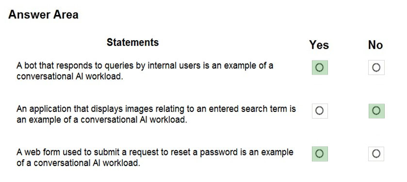

##### **Reference:**

https://docs.microsoft.com/en-us/azure/bot-service/bot-service-overview-introduction?view=azure-bot-service-4.0

#### **QUESTION: 131**

You need to provide content for a business chatbot that will help answer simple user queries.  
What are three ways to create question and answer text by using QnA Maker? Each correct answer presents a complete solution.  
Note: Each correct selection is worth one point.

1.  Generate the questions and answers from an existing webpage.
2.  Use automated machine learning to train a model based on a file that contains the questions.
3.  Manually enter the questions and answers.
4.  Connect the bot to the Cortana channel and ask questions by using Cortana.
5.  Import chit-chat content from a predefined data source.

**Answer(s):** A,C,E

##### **Explanation:**

Automatic extraction  
Extract question-answer pairs from semi-structured content, including FAQ pages, support websites, excel files, SharePoint documents, product manuals and policies.

##### **Reference:**

https://docs.microsoft.com/en-us/azure/cognitive-services/qnamaker/concepts/content-types

#### **QUESTION: 132**

You have a frequently asked questions (FAQ) PDF file.  
You need to create a conversational support system based on the FAQ.  
Which service should you use?

1.  QnA Maker
2.  Text Analytics
3.  Computer Vision
4.  Language Understanding (LUIS)

**Answer(s):** A

##### **Explanation:**

QnA Maker is a cloud-based API service that lets you create a conversational question-and-answer layer over your existing data. Use it to build a knowledge base by extracting questions and answers from your semi-structured content, including FAQs, manuals, and documents.

##### **Reference:**

https://azure.microsoft.com/en-us/services/cognitive-services/qna-maker/

#### Gentle Reminder

Please prepare for the recently added Gen AI under the AI-900 certification which is missing in this list. You can find the necessary resources at [Introduction to Generative AI](https://learn.microsoft.com/training/paths/introduction-generative-ai/).

## My Outcome

I took CS50 AI, AI and DS as part of my academic degree and learned a lot from online resources as a self-learner. Therefore, it was easy for me to cram and score 871/100, surpassing the passing score of 700. Although I didn't go through the official learning path, I did review the official practice tests and the questions from my notes.

## Certificate

[Verify my certification](https://learn.microsoft.com/en-us/users/anxkhn/credentials/60e4a16a343378da)

---

V1.0 (2024) PDF Version

If you found this repository helpful, please leave a star. Feel free to reach out to me on [LinkedIn](https://linkedin.com/in/anxkhn) or [Twitter](https://x.com/anxkhn) if you need any assistance.
